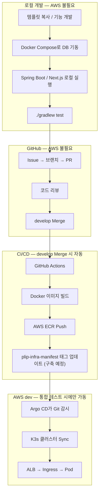

# PLIP 개발 → 배포 가이드 (팀 공유용 )

plip-template, AWS·K3s 아키텍처 다이어그램, Q&A를 모두 반영한 문서

---

## 한 줄 요약

개발자는 **로컬 PC에서 Docker Compose + Spring Boot/Next.js**로 개발하고, **`develop` 브랜치 Merge** 시 **GitHub Actions → ECR → Argo CD → K3s**로 AWS dev 서버에 자동 배포됩니다. 평소 PR/Merge 작업에는 **AWS를 켤 필요가 없습니다.**

---

## 전체 흐름



---

## 1. 로컬 개발

### `plip-template` 참고

### 배포 흐름은 프론트/백엔드 **동일** (Docker → ECR → Argo CD → K3s)

### 로컬 vs AWS

| 상황 | AWS 필요? |
| --- | --- |
| 개인 기능 개발 | ❌ |
| PR 생성 / 코드 리뷰 | ❌ |
| `develop` Merge | ❌ (GitHub에서 처리) |
| 배포 결과 확인 / 통합 테스트 | ⭕ dev 서버 **필요할 때만** 가동 |

> AWS dev 서버는 **통합 테스트가 필요할 때만** 켭니다. 꺼져 있다가 나중에 켜도 Argo CD가 Git 최신 커밋 기준으로 자동 배포합니다.
> 

---

## 2. Git 협업 프로세스

**CI (GitHub Actions)** — `develop` / `main` PR·push 시:

```bash
./gradlew test --no-daemon   # JDK 17
```

---

## 3. CI/CD & GitOps

### develop Merge → 자동 배포

```
1. develop 브랜치 Merge
2. GitHub Actions
   ├── Docker 이미지 빌드 (Spring Boot / Next.js)
   ├── AWS ECR Push
   └── plip-infra-manifest 저장소의 이미지 태그 업데이트
3. Argo CD (K3s Master)가 매니페스트 저장소 감시
4. 변경 감지 → K3s 클러스터 자동 Sync
```

| 구성요소 | 역할 |
| --- | --- |
| **GitHub Actions** | 이미지 빌드 + ECR Push + 매니페스트 태그 갱신 |
| **AWS ECR** | Docker 이미지 저장소 |
| **`plip-infra-manifest`** | K8s YAML, Argo CD Application 정의 (구축 예정) |
| **Argo CD** | Git ↔ 클러스터 상태 동기화 (GitOps) |

> 매니페스트 저장소는 인프라 담당자가 구축 후 공유합니다. 팀원은 배포 YAML 및 이미지 태그 변경 이력을 해당 저장소에서 확인합니다.
> 

---

## 4. AWS 인프라

### Terraform (IaC) — 인프라 담당자 전담

VPC, EC2, ALB, Route 53, CloudFront, ElastiCache 등 **모든 AWS 리소스는 Terraform으로 관리**합니다.

> **애플리케이션 개발자**는 인프라 변경 없이 **코드 개발 + GitHub Actions 파이프라인**에만 집중합니다.
> 

### 네트워크 구조

```
Internet
  ↓
Route 53 (DNS)
  ↓
CloudFront (CDN — S3 정적 미디어)
  ↓
Internet Gateway → VPC
  ├── Public Subnet
  │     ├── ALB
  │     └── NAT Instance
  └── Private Subnet
        ├── K3s Master (Argo CD, Ingress)
        ├── K3s Worker Nodes
        └── ElastiCache Redis
```

### K3s 노드 구성

| 노드 | EC2 | 수량 | 배치 서비스 |
| --- | --- | --- | --- |
| **Master** | t3.small | 1 고정 | K3s Control Plane, **Argo CD**, **Ingress** |
| **DB (Stateful)** | t3.medium* | 1 고정 | MySQL, MongoDB, Kafka (`role=db`) |
| **Monitoring** | t3.small | 1 고정 | Prometheus, Grafana (`role=monitoring`) |
| **NAT Instance** | t3.micro | 1 고정 | Private Subnet 아웃바운드 |
| **App Server (ASG)** | t3.small | **1~3 가변** | Spring Boot, Next.js (`role=server`) |

*  프리티어 제약으로 초기 t3.small, 이후 확장 예정

### 트래픽 경로

```
사용자 → Route 53 → CloudFront / ALB
  → Ingress (Master)
  → Next.js / Spring Boot Pod (Worker 1[A], 1[B])
  → MySQL / MongoDB / Kafka / Redis
```

---

## 5. K8s 내장 기능으로 대체

| 기존 (로컬/레거시) | K3s 대체 | 설명 |
| --- | --- | --- |
| **Eureka** | **CoreDNS** | `http://user-service` 서비스명 기반 DNS·로드밸런싱 |
| **Spring Cloud Gateway** | **Ingress Controller** | ALB → Ingress → Pod 라우팅 |

> `plip-template`의 Eureka 설정은 **로컬 개발용**입니다. 운영 K3s에서는 사용하지 않습니다.
> 

---

## 6. 서비스 ↔ 데이터 매핑

팀 ERD 기준, **도메인 담당자가 전담** 개발합니다.

| 저장소 | 용도 | 도입 범위 |
| --- | --- | --- |
| **MySQL (RDB)** | 트랜잭션, 관계형 데이터 | 각 도메인별 테이블·비즈니스 로직 |
| **MongoDB (NoSQL)** | 비정형 메타데이터, 대용량 로그 | 도메인 필요 시 개별 도입 |
| **Redis (ElastiCache)** | 토큰/세션, URL·캐시 | Auth/Token, URL/Cache 인스턴스 |
| **Kafka** | 비동기 이벤트 스트리밍 | **채팅 기능 담당자 우선** 도입 |
| **S3 + CloudFront** | 정적 미디어 | 이미지·동영상 CDN |

**마이크로서비스 원칙:** 서비스마다 **독립 DB** — 타 서비스 DB 직접 접속·JOIN 금지.

---

## 7. 환경 & 모니터링

### 환경 구분

| 환경 | 용도 | 비고 |
| --- | --- | --- |
| **dev** | 개발 서버 | Argo CD Application 환경별 분리 |
| **prod** | 운영 | Argo CD Application 환경별 분리 |
| **staging** | — | **현재 없음** — 팀 회의에서 도입 여부 논의 예정 |

### 모니터링

| 계층 | 도구 | 위치 |
| --- | --- | --- |
| K8s / 앱 | Prometheus + Grafana | Worker Node 3 (Monitoring) |
| AWS 인프라 | CloudWatch | AWS 전체 |

---

## 8. 역할 분담

| 역할 | 담당 |
| --- | --- |
| 애플리케이션 코드 개발 | 각 도메인 담당자 |
| Docker 빌드 / GitHub Actions | 개발자 (서비스 레포) |
| Terraform / AWS 프로비저닝 | **인프라 담당자** |
| K8s 매니페스트 / Argo CD | **인프라 담당자** (`plip-infra-manifest` 구축) |
| 시크릿 관리 | **추후 확정** (K8s Secret, env 등) |

---

## 9. 신규 개발자 온보딩 체크리스트 (그냥 참고용)

### Day 1 — 환경 세팅

- [ ]  담당 서비스 레포 Clone (`plip-template` 또는 파생 레포)
- [ ]  JDK 17, Docker Desktop 설치
- [ ]  `START.md` 따라 패키지명·포트·DB 설정
- [ ]  `.env` 작성
- [ ]  `docker compose up -d` + 로컬 Spring Boot 기동
- [ ]  Swagger UI 확인 (`/swagger-ui/index.html`)
- [ ]  `./gradlew compileJava` (Git hooks 설치)

### Day 2 — 첫 PR

- [ ]  `GIT_CONVENTION.md` 숙지
- [ ]  Issue → `feature/{번호}-{설명}` 브랜치 (from `develop`)
- [ ]  기능 개발 + `./gradlew test`
- [ ]  PR → CI 통과 → 리뷰 → **`develop` Merge**
- [ ]  (선택) 통합 테스트 필요 시 AWS dev 서버 가동 → 배포 결과 확인

---

## 10. FAQ

**Q. PR Merge할 때 AWS를 켜야 하나요?**

→ 아니요. Merge는 GitHub에서 처리됩니다. 배포 결과를 직접 확인할 때만 dev 서버를 켭니다.

**Q. 서버를 껐다 켜면 배포를 다시 해야 하나요?**

→ 아니요. Argo CD가 Git 최신 커밋을 읽어 자동 Sync합니다.

**Q. 로컬에서 Eureka/Gateway를 켜야 하나요?**

→ 아니요. 로컬은 `eureka.client.enabled: false`(기본)입니다.

**Q. 인프라(Terraform, K8s YAML)를 수정해야 하나요?**

→ 아니요. 앱 개발자는 코드와 GitHub Actions에만 집중합니다. 인프라는 담당자가 관리합니다.

---

## 11. 추후 확정·공유 예정

| 항목 | 상태 |
| --- | --- |
| `plip-infra-manifest` 저장소 | 구축 후 URL 공유 |
| 시크릿 관리 (DB, JWT 등) | 팀 논의 후 확정 |
| Staging 환경 | 팀 회의에서 도입 여부 결정 |
